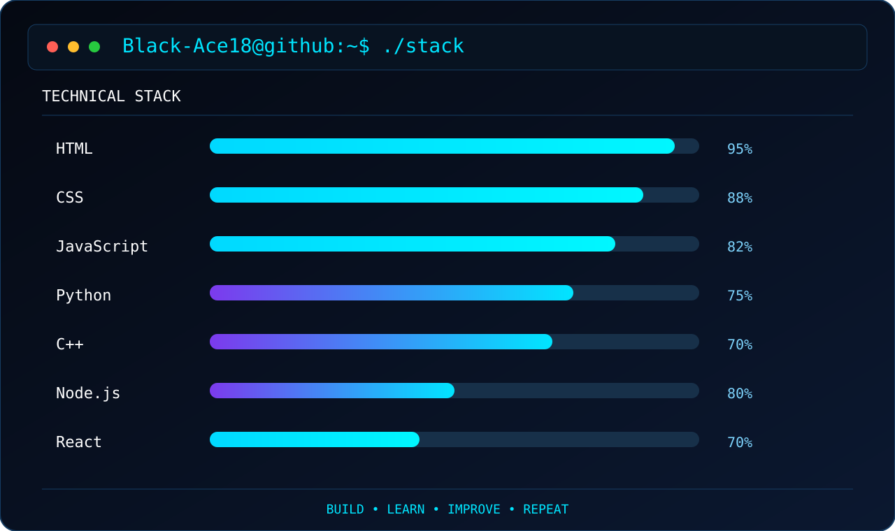

<div align="center">




</div>




## TERMINAL :: STACK

<p align="center">
  
</p>


```cpp
class Umer {

public:

    void everyday() {

        Learn();

        Build();

        Fail();

        Improve();

        Repeat();

    }

};

int main() {

    Umer me;

    while(true)
        me.everyday();

}
```


## FILE SYSTEM

```text
.
├── Rogue-Mentor/
├── Shadow-Strategist/
├── Spotify-Clone/
├── Custom-ROMs/
├── NFT-Development/
└── More-Coming/
```


## CONNECTIONS

```yaml
Portfolio:
  https://umerkhan.framer.website

LinkedIn:
  https://linkedin.com/in/muhammedumerkhan

GitHub:
  https://github.com/Black-Ace18
```


<div align="center">

### END OF TRANSMISSION

```text
Connection Established...

No fancy statistics.
No meaningless badges.

Just code.
Just progress.

See you again.
```

</div>
